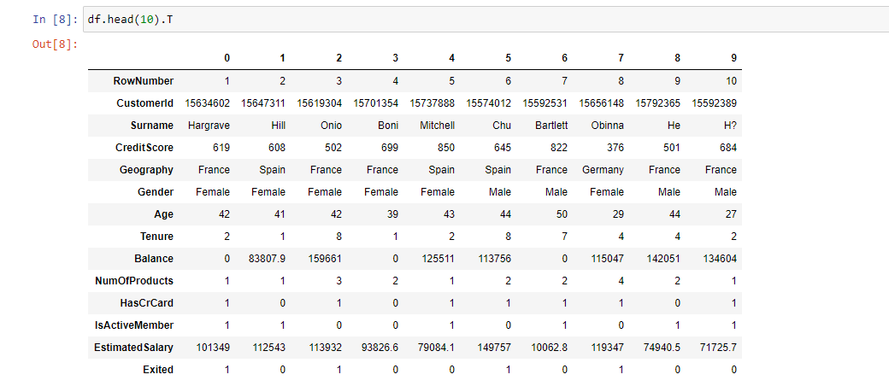
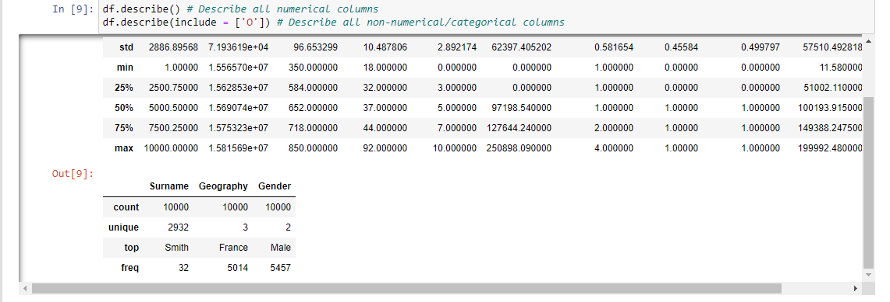

# Customer-Churn-Prediction-Pipeline
## Problem we are facing:
A bank has been observing a lot of customers closing their accounts or switching to competitor banks over the past couple of quarters. As such, this has caused a huge dent in the quarterly revenues and might drastically affect annual revenues for the ongoing financial year, causing stocks to plunge. 
## Objective:
Building a model to predict the customers who are going to churn in the near future, and automate this process into a pipeline formate for faster usage.
## Business metrics:
- Churn rate (month-on-month, weekly/quarterly)
- Trend of average number of products per customer
- Age of dormant customers
- etc
## Data metrics:
- Recall = TP / (TP + FN)
- Precision = TP / (TP + FP)
- F1-score = Harmonic mean of Recall and Precision
- TP = True Positive, FP = False Positive and FN = False Negative
## Goal for the metrics:
- Recall : >70%
- Precision : >70%
- F1-score : >70%

## Basic EDA:
I performed some basic EDAs over the dataset. Here are some highlight:

- Conclusion:
  - Drop the row number
  - Drop CustomerID, because each row points to a unique customer

## Questions about the data:
1. No date information
2. How frequently are customer features updated?
3. Some customers who have exited still have balance in their account, or a non-zero NumOfProducts. Does this mean they have churned only from a specific product and not the entire bank?

## Model used:
- Random Forest
- Light Gardient Bossted Machine
- XGBoost
- Naive Bayes (Gaussian/Multinomial)
- kNN\
## Remining steps can be find in the included jupyter notebook
